# GitHub Actions CI/CD Pipeline

## Yaml syntax for work flows
- name: Example Workflow
- on: [push]

## Workflow structure
- **Workflow File**: Located in `.github/workflows` directory, e.g., `main.yml`.
- **Jobs**: Define tasks like building, testing, deploying.
- **Steps**: Individual tasks within a job.
- **Actions**: Reusable units of code within steps.
- **Events**: Triggers for the workflow, e.g., `push`, `pull_request`.
- **Runners**: The server where the job runs, e.g. `ubuntu-latest`.

# Setting up a Build job
Creating your workflow folders image
Defining build job and adding build steps image
Adding test instruction image


## 📁 Setting Up the Project

1. Create a GitHub repository named **`Github-Action-ci-cd-pipeline`**.
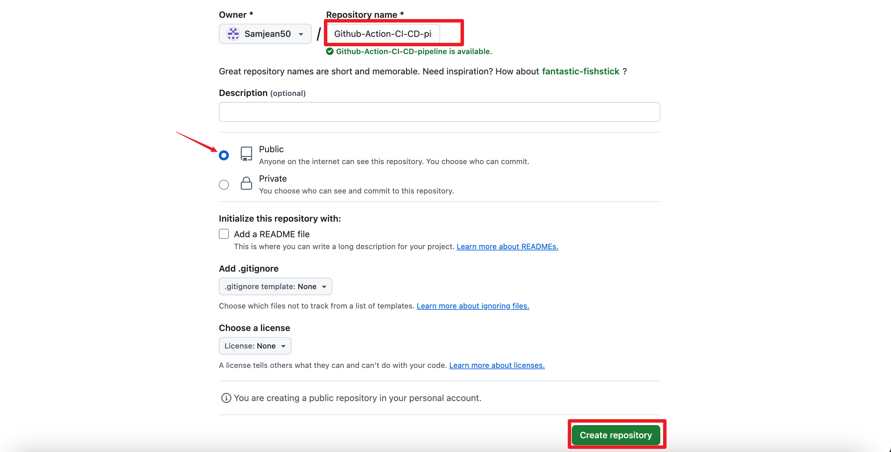

2. Clone the repository locally using the command:

   ```bash
   git clone https://github.com/Samjean50/Github-Action-ci-cd-pipeline.git
   ```
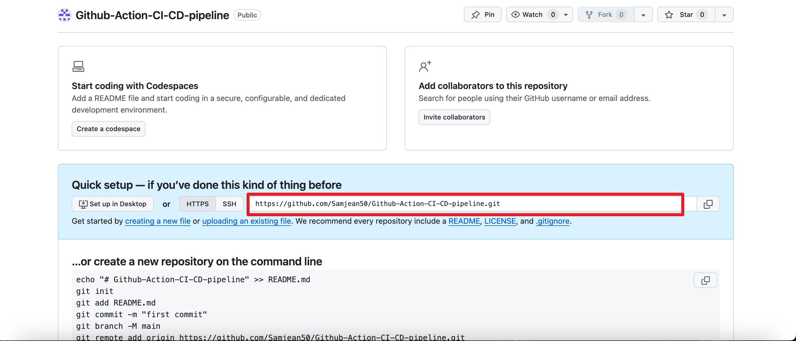
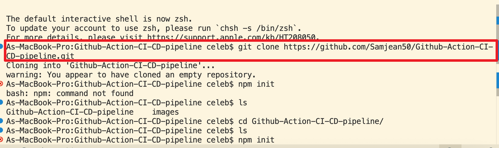

3. Inside the project folder, initialize a Node.js project:

```bash
npm init 
```
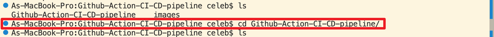
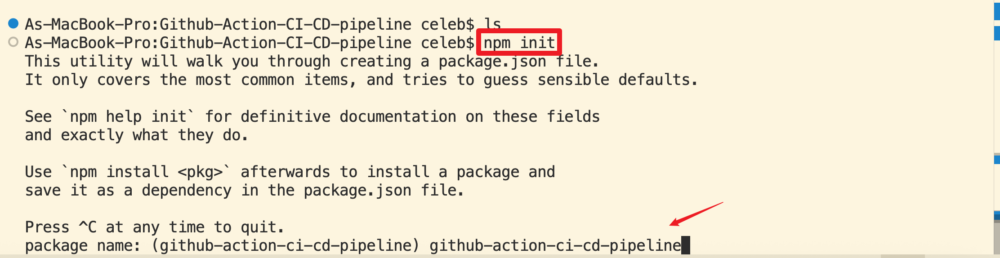

4. Create a simple Node.js application in a file named index.js:

```javascript
// index.js
const express = require('express');
const app = express();
const port = process.env.PORT || 3000;

app.get('/', (req, res) => {
  res.send('Hello World!');
});

app.listen(port, () => {
  console.log(`App listening at http://localhost:${port}`);
});
```
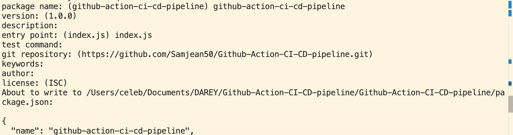
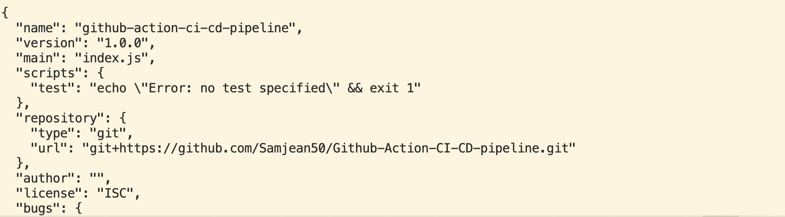

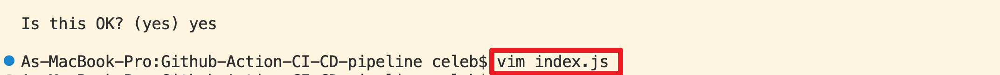
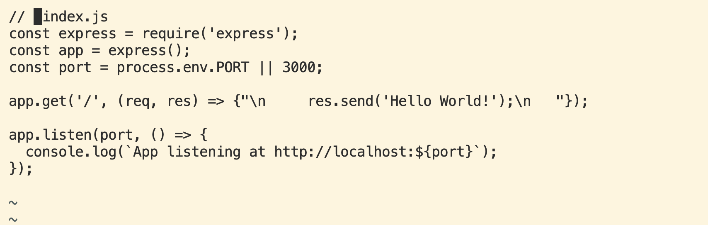
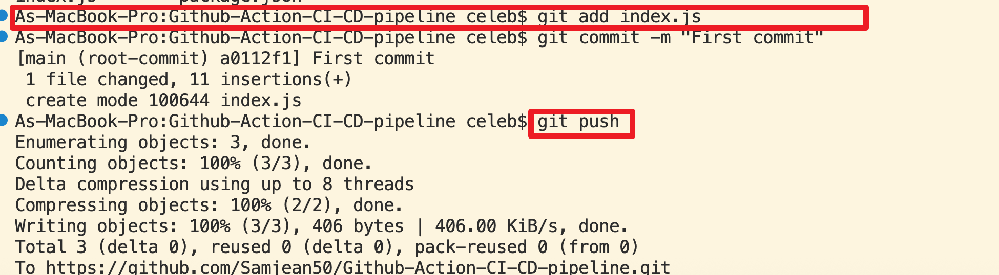

5. Writing a CI Workflow
- Create a .github/workflows directory if it doesn't already exist.
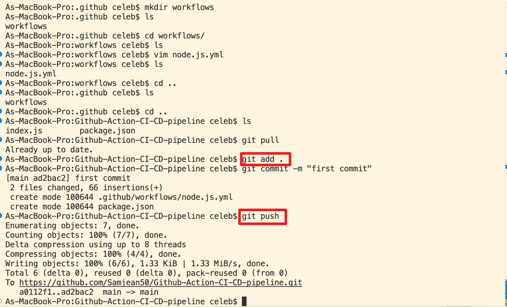

- Inside it, create a file named node.js.yml.
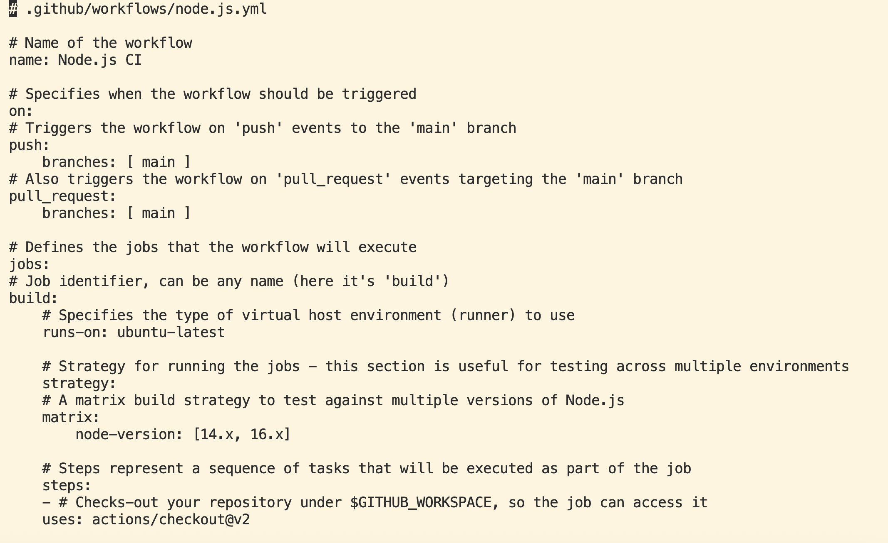
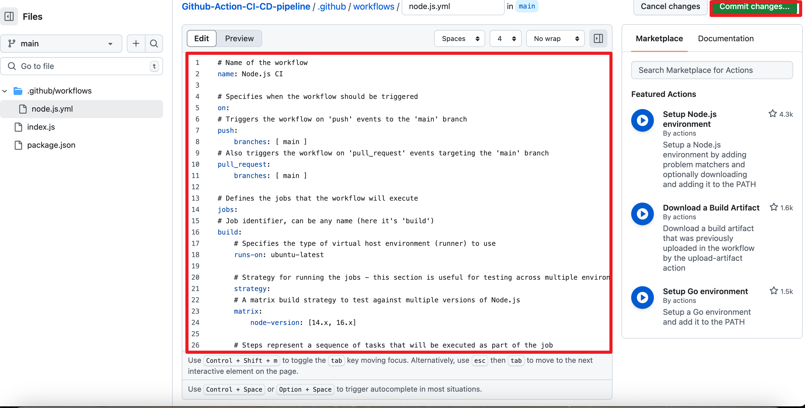

- Add the following workflow script to automate testing across different Node.js versions:


```yaml

name: test

on:
  pull_request:
    branches:
      - main

jobs:
  test:
    runs-on: ubuntu-latest
    container:
      image: node:20

    steps:
      - uses: actions/checkout@v3

      - name: Install dependencies
        run: npm install

      - name: Run tests
        run: npm test

      - name: Build project
        run: npm run build
```

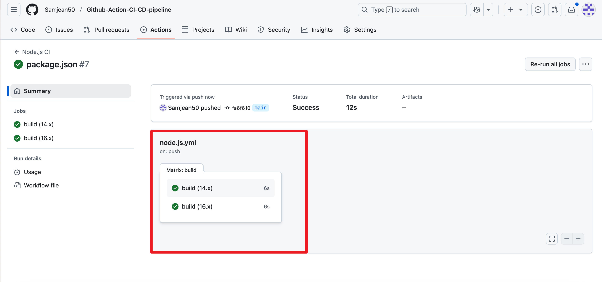
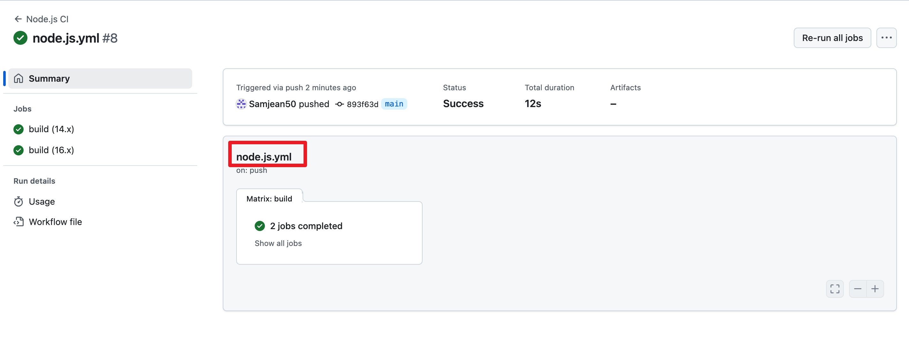
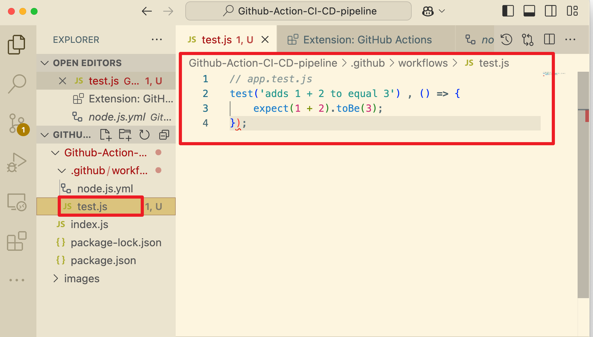
1. Deployment and Experimentation
Add a second workflow file for deployment. Create deploy.yml inside .github/workflows:

```yaml
name: Deploy Application

on:
  push:
    branches:
      - main

jobs:
  deploy:
    runs-on: ubuntu-latest

    steps:
      - name: Checkout code
        uses: actions/checkout@v4

      # Add build steps here if needed
      # - name: Build
      #   run: echo "Build your app here"

      - name: Deploy to Server
        run: |
          echo "Deploying application..."
          # Add your deployment commands here
          # For example, scp files or use rsync, or call a deploy script
```
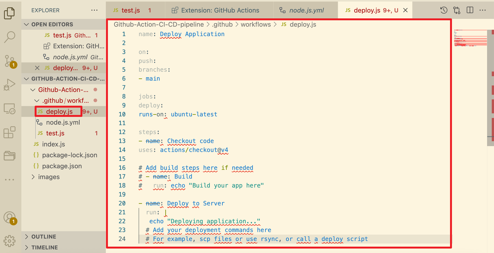
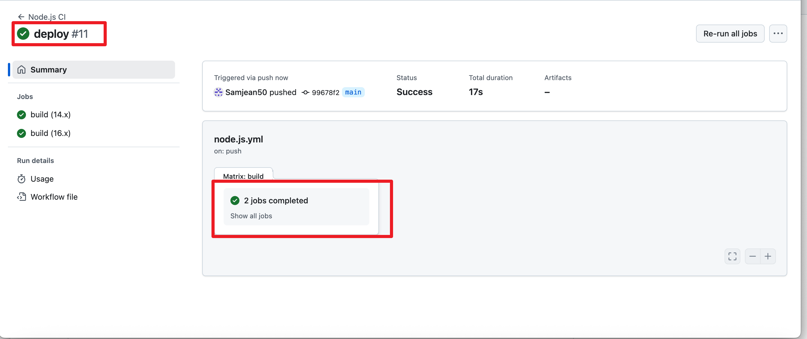
7. Adding Start and Test Scripts
Update your package.json file to include the following scripts:

```json
"scripts": {
  "start": "node index.js",
  "test": "echo \"No tests specified\" && exit 0"
}
```
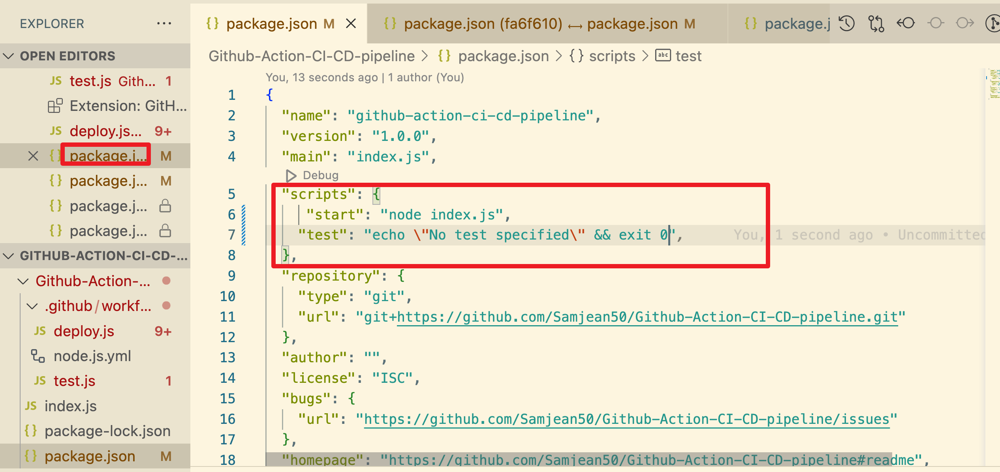
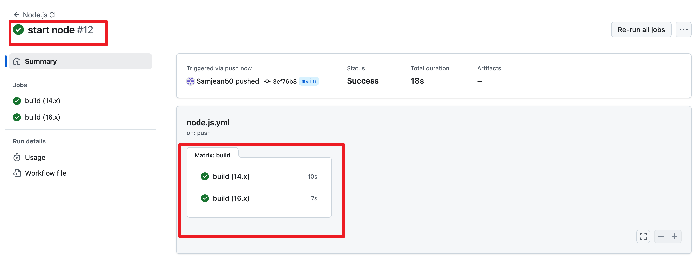


1. Launch Success
Your CI/CD pipeline is now complete. You have:

- Initialized a Node.js project

- Written GitHub Actions workflows for testing and deployment

- Set up a deployable application
  
- Verified your app is live and accessible 🎉

- You can now deploy using GitHub Actions and serve your Node.js app through services like Render, Heroku, or your own server.

## Additional YAML Concepts in Github actions
- Using Environment variables
Env help you pass configuration and settings image

```env:
  CUSTOM_VAR: value
  # Define an environment variable 'CUSTOM_VAR' at the workflow level.

jobs:
  example:
    runs-on: ubuntu-latest
    steps:
    - name: Use environment variable
      run: echo $CUSTOM_VAR
      # Access 'CUSTOM_VAR' in a step.
```

- Working with Secrets image
```
jobs:
  deploy:
    runs-on: ubuntu-latest
    steps:
    - name: Use secret
      run: |
        echo "Access Token: ${{" secrets.ACCESS_TOKEN "}}"
        # Use 'ACCESS_TOKEN' secret defined in the repository settings.
```
- Conditional Execution image
```
jobs:
  conditional-job:
    runs-on: ubuntu-latest
    if: github.event_name == 'push' && github.ref == 'refs/heads/main'
    # The job runs only for push events to the 'main' branch.
    steps:
    - uses: actions/checkout@v2
```

- Using Outputs and Inputs between steps image
```
jobs:
  example:
    runs-on: ubuntu-latest
    steps:
    - id: step-one
      run: echo "::set-output name=value::$(echo hello)"
      # Set an output named 'value' in 'step-one'.
    - id: step-two
      run: |
        echo "Received value from previous step: ${{" steps.step-one.outputs.value "}}"
        # Access the output of 'step-one' in 'step-two'.
```


