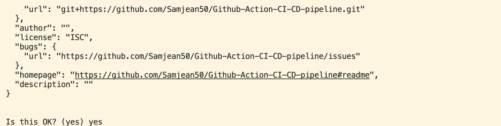

# GitHub Actions CI/CD Pipeline

## 📁 Setting Up the Project

1. Create a GitHub repository named **`Github-Action-ci-cd-pipeline`**.


2. Clone the repository locally using the command:

   ```bash
   git clone https://github.com/Samjean50/Github-Action-ci-cd-pipeline.git
   ```


3. Inside the project folder, initialize a Node.js project:

```bash
npm init 
```


4. Create a simple Node.js application in a file named index.js:

```javascript
// index.js
const express = require('express');
const app = express();
const port = process.env.PORT || 3000;

app.get('/', (req, res) => {
  res.send('Hello World!');
});

app.listen(port, () => {
  console.log(`App listening at http://localhost:${port}`);
});
```





5. Writing a CI Workflow
- Create a .github/workflows directory if it doesn't already exist.


- Inside it, create a file named node.js.yml.


- Add the following workflow script to automate testing across different Node.js versions:


```yaml

name: test

on:
  pull_request:
    branches:
      - main

jobs:
  test:
    runs-on: ubuntu-latest
    container:
      image: node:20

    steps:
      - uses: actions/checkout@v3

      - name: Install dependencies
        run: npm install

      - name: Run tests
        run: npm test

      - name: Build project
        run: npm run build
```


1. Deployment and Experimentation
Add a second workflow file for deployment. Create deploy.yml inside .github/workflows:

```yaml
name: Deploy Application

on:
  push:
    branches:
      - main

jobs:
  deploy:
    runs-on: ubuntu-latest

    steps:
      - name: Checkout code
        uses: actions/checkout@v4

      # Add build steps here if needed
      # - name: Build
      #   run: echo "Build your app here"

      - name: Deploy to Server
        run: |
          echo "Deploying application..."
          # Add your deployment commands here
          # For example, scp files or use rsync, or call a deploy script
```


7. Adding Start and Test Scripts
Update your package.json file to include the following scripts:

```json
"scripts": {
  "start": "node index.js",
  "test": "echo \"No tests specified\" && exit 0"
}
```


1. Launch Success
Your CI/CD pipeline is now complete. You have:

- Initialized a Node.js project

- Written GitHub Actions workflows for testing and deployment

- Set up a deployable application

- Verified your app is live and accessible 🎉

- You can now deploy using GitHub Actions and serve your Node.js app through services like Render, Heroku, or your own server.
